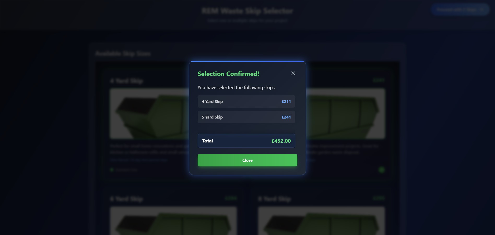

# REM Waste Skip Selector

Hey there! 👋 Welcome to my skip selector project. I wanted to create something that makes choosing the right skip size a breeze while looking modern and feeling satisfying to use.

## What's This All About?

This is a modern web interface for selecting waste skips of different sizes. I got tired of seeing boring, old-school forms for this kind of thing, so I decided to spice it up with some nice animations and visual feedback.

## Screenshots

Here are a few glimpses of the application:

## Features

* **Interactive Skip Cards**: Each skip is presented in a card with a cool 3D hover effect

* **Multi-select**: Pick as many skips as you need

* **Real-time Price Updates**: See your total cost update as you select skips

* **Visual Feedback**: Nice animations and color changes when you select/deselect skips

* **Responsive Design**: Works great on both desktop and mobile

* **Accessibility**: Built with keyboard navigation and screen readers in mind

## Video Demo

For a comprehensive walkthrough of the application's features and interactivity, watch the GIF below:

## Tech Stack

* React (for the UI components)

* Framer Motion (for those sweet animations)

* TailwindCSS (for styling)

## Design Choices

I went with a dark theme because it looks more modern and reduces eye strain. The neon effects and subtle animations make the interface feel alive without being distracting. The two-column layout on desktop gives enough space for the skip images while keeping everything readable.

The frosted glass effect on the cards adds depth without compromising readability. I chose green for success states and blue for interactive elements since these colors are commonly associated with these actions.

## Getting Started

1. Clone the repo

2. Run `npm install`

3. Run `npm start`

4. Open <http://localhost:3000>

## Future Improvements

Some things I'd like to add:

* Save selections to local storage

* Add a comparison view

* Include more skip details and specifications

* Add a checkout process

* Implement skip availability checking

## Contributing

Feel free to open issues or submit PRs if you have ideas for improvements! I'm always open to suggestions.

## License

MIT - do whatever you want with it! 🚀"# REMWaste" 
"# REMWaste" 
"# REMWaste" 
